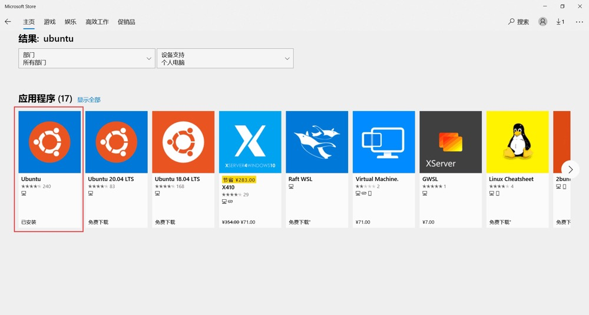

# arms使用


## arms运行环境
arms 必须在类linux系统中运行，如果是Windows电脑，可以先在微软市场中，搜索安装ubuntu子系统


然后在任意目录，shift + 鼠标右键，选择“在此处打开 linux shell”即可。

## 安装arms
```
sudo pip3 install arms
```

## 初始化本地模版库
```
arms config https://github.com/lzj960515/arms-source.git
```

## 更新本地模版库
```
arms update
```

## 初始化项目
```
arms search KEYWORD   #KEYWORD是搜索关键词，例如java
arms init NAME   #NAME是搜索出的模版名称，例如universal-java
```

## 注意
* 需要先安装python3。
* 如果是windows系统，需要进入linux终端，才能安装和使用arms。


